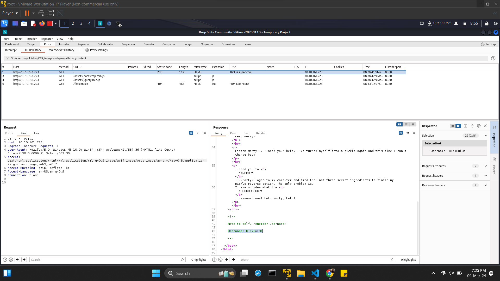
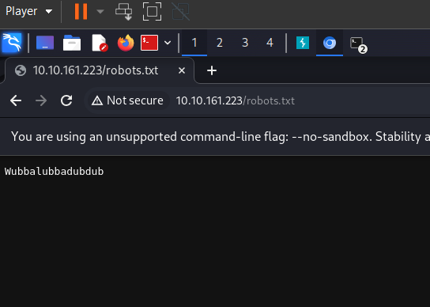
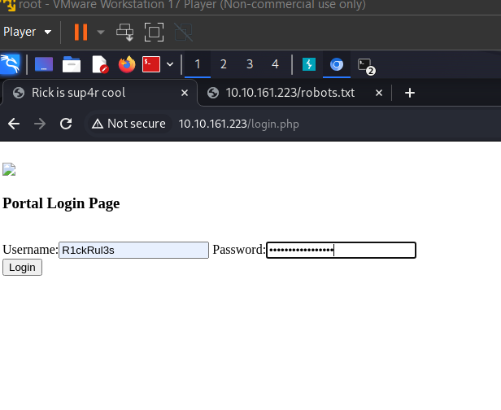
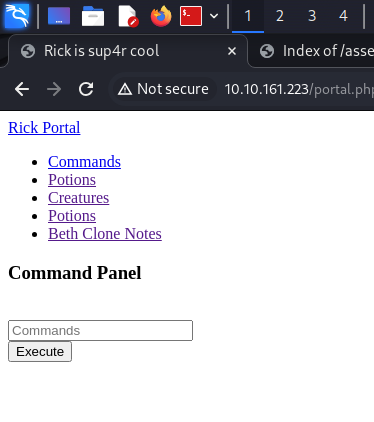
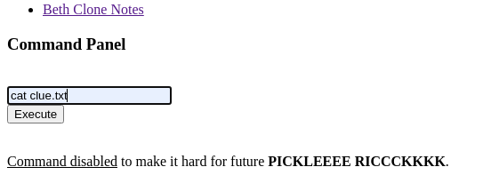

<h1 align="left">
    <strong>
        Try Hack Me
            <a href="">
                Pickel Rick
            </a>
    </strong>
</h1>


<h2 align="left">
    <strong>
        MACHINE_IP - 10.10.161.223
    </strong>
</h2>


Connect to Open VPN THM instance by downloding the open VPN configuration file

Start Machine to get MACHINE_IP for the web app

MACHINE_IP - 10.10.161.223


1 - Open the web page hosted on Machine IP in Burpsuit HTTP Proxy

2 - In the Response we see a comment added by Rick as note - 

> Clue 1 - Username: R1ckRul3s



3 - Try to find out more endpints of the webpage by - 


4 - we found a robots.txt file with the content 
> Clue 2 - Wubbalubbadubdub



5 - we also see a login.php page, lest try loging in with the previous 2 Clues



and we are in we see some some links pointing to denied.php (thats a decoy 😂) & a input filed for running some command 



lest try -
```bash
ls -la
```
we get -

```bash
total 40
drwxr-xr-x 3 root   root   4096 Feb 10  2019 .
drwxr-xr-x 3 root   root   4096 Feb 10  2019 ..
-rwxr-xr-x 1 ubuntu ubuntu   17 Feb 10  2019 Sup3rS3cretPickl3Ingred.txt
drwxrwxr-x 2 ubuntu ubuntu 4096 Feb 10  2019 assets
-rwxr-xr-x 1 ubuntu ubuntu   54 Feb 10  2019 clue.txt
-rwxr-xr-x 1 ubuntu ubuntu 1105 Feb 10  2019 denied.php
-rwxrwxrwx 1 ubuntu ubuntu 1062 Feb 10  2019 index.html
-rwxr-xr-x 1 ubuntu ubuntu 1438 Feb 10  2019 login.php
-rwxr-xr-x 1 ubuntu ubuntu 2044 Feb 10  2019 portal.php
-rwxr-xr-x 1 ubuntu ubuntu   17 Feb 10  2019 robots.txt

```

let's try to cat clue.txt & Sup3rS3cretPickl3Ingred.txt but the cat command is disables by Rick 



let's get creatiuve and try tac 

```bash
tac clue.txt
```
we dont get much from Clue.txt but Sup3rS3cretPickl3Ingred.txt give us the first ingredient that Rick needs

<h3 align="left">
    <strong>
        1 - What is the first ingredient that Rick needs?
    </strong>
</h3>

> command
```bash
tac Sup3rS3cretPickl3Ingred.txt
```
> output
```
mr. meeseek hair
```


5 - let's consider advice from Clue.txt and expolore the Files system

we do have acces to sudo in files system lest try
```bash
ls ../../../
```
we find a home and Rick directory, and in the directory we find 

```bash 
tac ../../../home/rick/

```


<h3 align="left">
    <strong>
        2 - What is the second ingredient in Rick’s potion?
    </strong>
</h3>


short explanatin of solutions

> command
```bash
sudo nmap -sn 10.129.2.0/24
```
> output
```
nmap - output here
```


<h3 align="left">
    <strong>
        3 - What is the last and final ingredient?
    </strong>
</h3>


short explanatin of solutions

> command
```bash
sudo nmap -sn 10.129.2.0/24
```
> output
```
nmap - output here
```


htb - nmap, starting point
thm - pickel rick

